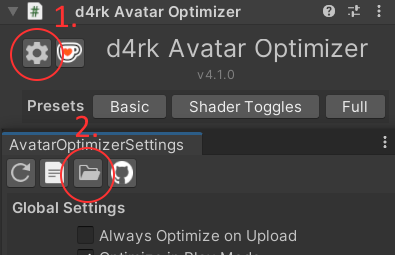
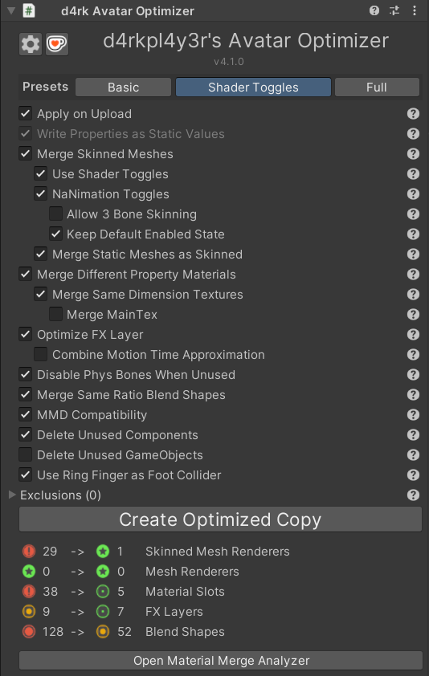
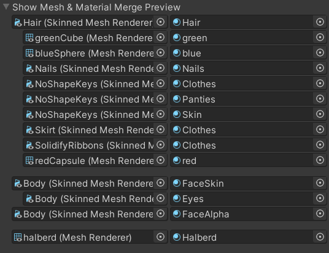

# d4rkAvatarOptimizer
d4rkpl4y3r's VRChat avatar 3.0 optimizer that aims to reduce skinned mesh & material count.

## How to Use
1. Add the d4rkAvatarOptimizer component to your avatar root. It should go on the same object that your VRC Avatar Descriptor is on.
2. Upload the avatar to vrc. The optimizations will be applied before upload automatically with the default settings.

Alternatively you can click the "Create Optimized Copy" button to create a new avatar with optimized materials and meshes. That way you can test the optimized version in editor to validate it works properly before uploading it. If everything works correctly you can then upload that optimized copy.

## Installation
To install the optimizer with VCC you need to add the url `https://d4rkc0d3r.github.io/vpm-repos/main.json` as a custom repository.

1. [Click here](https://d4rkc0d3r.github.io/vpm-repos/main_redirect.html)
2. Allow the redirect to open with VCC
3. VCC should now be open with a dialog asking you to add the repository
4. Click I understand, Add Repository in the popup after reading its contents

After that you can add and update the optimizer like any other packages in your VCC projects.

## Presets
### Basic
This preset only uses optimizations that don't affect the behavior of the avatar.
* Removes unused components and blendshapes & bones from skinned meshes
* Bakes non animated blend shapes into the mesh
* Merges all skinned meshes that are always animated in the same way
* Merges material slots that use the same material
* Merges toggles in the FXLayer into a direct blend tree
* Merges blend shapes that are always animated in the same ratio to each other
### Shader Toggles
This preset uses all the above & some new optimizations.  
For this mode you should keep shaders unlocked as it can allow for more merging.  
* Merges meshes even if they are animated/toggled differently by injecting logic into the shaders
* Merged materials with the same shader even if their properties differ
* Applies a generalized version of "lock in" to the new shaders
Due to the added shader logic this preset will slightly increase the GPU cost of the avatar as a trade off for less draw calls.

Expect the following behavior changes (reduced due to NaNimation toggles):
* World effects that rely on projectors/shader replacement don't understand shader toggles and will show like the merged meshes are always visible
  * Some examples of this are wire frame shaders and screen space ambient occlusion
* With blocked shaders all merged meshes that now rely on shader toggles are always visible
  * Make sure DPS/TPS penetrators don't show up! The optimizer tries to detect and exclude them from shader toggles. If it fails you need to exclude them manually
### Full
This preset uses all optimizations I use for my own avatars.  
Some of the settings used here compromise quality of the avatar heavily when animations/shaders are blocked.  
It has some more experimental & some behavior changing ones. Testing that your avatar still works as intended is very needed in this mode. If it doesn't switch to a lower optimization preset.

## Why my Shader Pink?
Shaders can do a lot of *weird* things, therefore the optimizer is bound to fail on some of them. Here is a couple things you could try:
* Use different shaders, for example:
  * [Poiyomi Toon](https://github.com/poiyomi/PoiyomiToonShader)
  * [Silent Crosstone](https://gitlab.com/s-ilent/SCSS)
  * [ACLS](https://booth.pm/ja/items/1779615)
* Use the "Basic" preset which causes the optimizer to not touch the shaders at all.
* Use the "Exclusions" foldout to manually only exclude meshes from optimization that are broken.

It is also nice to make a bug report with the broken shaders so I can fix it for the future.  
To do that you need to bundle up the optimized `.mat`, `.shader` & `.cginc` files. You can do that by right clicking on `d4rkAvatarOptimizer/TrashBin` in the project view under `Packages` and selecting `Show in Explorer`. A window with the folder selected should open. Go inside the folder and put the files into a `.zip` file. You don't need to include the `.asset` files as they can be very large and don't help when debugging the shaders.  
Once you have done that make a bug report on the [issue tracker](https://github.com/d4rkc0d3r/d4rkAvatarOptimizer/issues) where you can attach the `.zip` file.

## UI Options Documentation
There are also some settings to tweak the optimization. You can read about their effects in more detail here:

## Apply on Upload
Automatically applies the optimizer to the avatar before uploading it to vrc. This is non destructive, the avatar in your scene will stay as it is.
## Write Properties as Static Values
This is very similar to what some shaders call locking in or baking. If you use this option you should disable the locking in or baking feature of your shader.

When enabled the optimizer will replace the uniform parameter definitions with a static value on all materials.  
For example `uniform float4 _Color;` will get changed to `static float4 _Color = float4(1, 0, 1, 1);`  
This enables the shader compiler to do more [constant folding](https://en.wikipedia.org/wiki/Constant_folding) and thus making the shader run faster.  
Unfortunately the shader compiler is allowed to ignore NaNs while doing that so if a shader is not made with that in mind this might cause some issues.
## Merge Skinned Meshes
The optimizer tries to merge different skinned meshes together.  
This usually means meshes which always get animated in the same way will get merged.  
Skinned meshes that are on different layers (eg UIMenu) from each other will not get merged.  
Skinned meshes that are disabled and have no animation to turn them on will get deleted.  
## Use Shader Toggles
Merges meshes even if their material properties get animated differently or if they get toggled separately from each other.  
This will add logic to the shaders to ensure everything works correctly. Some shaders might not work correctly with this option enabled.  
Can't merge meshes that have any tessellation or surface shaders.  

Forces on `Write Properties as Static Values` if enabled.

Shader Toggles will not work with blocked shaders or projectors.
## NaNimation Toggles
Merges meshes even if they get toggled separately from each other.  
This will add an extra bone per original mesh that gets added to each vertex with a very low weight. This bones scale will be animated to NaN to toggle the mesh off.

Unlike the `Use Shader Toggles` option this does not require the shaders to be changed.  
It also doesn't have the problems of projectors and blocked shaders not understanding the toggles.

Might cause some issues with name plate & chat box position. If they are inside your head / way too far above your head you should disable this option.

It can't merge meshes that use a WD ON workflow when they are off by default unless the toggles are simple enough that they can get optimized by `Optimize FX Layer`.
## Allow 3 Bone Skinning
Allows NaNimation Toggles to be used on meshes that use 4 bone weights on some vertices reducing the skinning quality to only 3 effective bone weights.

You can see which meshes use 4 bone weights in the debug info section under `Mesh Bone Weight Stats`.
Any mesh that shows index 3 being used will be affected by reduced skinning quality if it has toggle animations.
## Keep Default Enabled State
Stops meshes that are enabled by default from getting merged with meshes that are disabled by default and vice versa.

This is useful to not look weird with blocked animations in case of NaNimation toggles. With this disabled and animations blocked all merged meshes will be visible.
## Merge Static Meshes as Skinned
Automatically converts static meshes to skinned meshes so that they can be merged with other meshes and have their materials merged as well. This only happens if the static mesh has materials that can be merged with materials from the skinned mesh it tries to get merged into.  
Does not convert meshes on the UIMenu layer since they are mostly used for computation.
## Merge Different Property Materials
Merges materials with the same shader where properties can have different values. If they do have different values the values will get written to a constant buffer. Material IDs get written to uv.w and used to access the correct value from that cbuffer.

If your shader has a "lock in" or "bake" feature, make sure to not use it with this optimizer if you have "Write Properties as Static Values" enabled. Locked in shaders will have different actual shaders for each material, so they can't be combined. "Write Properties as Static Values" will take over the job of locking in the shaders.

Can't merge materials if:
* Shader is surface shader or has tessellation
* A property that differs is used in shader lab code (eg `ZWrite [_ZWrite]`)
* Materials have different Keywords set
* Material slot is affected by a material swap animation

Forces on "Write Properties as Static Values" if enabled.
## Merge Same Dimension Textures
Merges materials if they use different textures if their width, height & compression format match.
Creates a Texture2DArray from the original textures.

Can't merge materials if:
* Shader declares Texture2D or sampler2D properties with a custom macro.  
  eg `#define CUSTOM_TEX2D(name) Texture2D name`
* The textures use crunch compression.
## Merge MainTex
If disabled, the optimizer will not merge materials that have different textures assigned to the `_MainTex` property.  
If you care about your avatar looking ok with disabled shaders you should disable this option.
## Merge Same Ratio Blend Shapes
This option tries to merge blend shapes that always get animated in the same ratio.  
For example you have two animations. The first animates `A` to 100, `B` to 50 and `C` to 100. The second animates `A` to 50, `B` to 25 and `D` to 100. In this case the optimizer would merge `A` and `B` in a 2:1 ratio as they are always animated in that ratio.
## Optimize FX Layer
Deletes all layers in the FXLayer that are considered useless:
  * Has no states or sub state machines.
  * Has 0 weight and is not affected by any layer weight control and has no state behaviours.
  * Has no state behaviours and only animates bindings that don't exist.

Tries to merge layers that are only doing toggles into a direct blend tree.
You can read about this technique [here](https://notes.sleightly.dev/dbt-combining/).

Toggles are layers that:
  * Have no state behaviours.
  * Have exactly two states.
  * Both states transitions point to the other state.
  * One state can only have a single transition while the other state has to have one transition with one inverse condition per condition of the first state.
  * Transition conditions can be bool `if` & `if not` or int `greater x` & `less x + 1`.
  
Multi toggles are layers that:
  * Have no state behaviours.
  * Have n > 2 states.
  * All states animate the exact same bindings.
  * No state has transitions.
  * For each \[0, n\) there is one any state transition that points to one unique state.
  * All any state transitions have only one int equals condition with the value of the state index. They all have to use the same int parameter.
  * The int parameter can't be used with a not equals condition in any transition condition anywhere in the fxlayer.
## Combine Motion Time Approximation
This tries to combine layers that have a single motion time state into the direct blend tree.  
By default it samples the original motion time at the snapping points of a radial puppet (0, 25, 50, 75, 100) and then uses those samples to approximate the motion time with a 1D blend tree.  
The amount of sample points can be changed in the `Motion Time Approximation Sample Count` global option. Samples that don't improve the approximation by more than 1% are discarded.
## Disable Phys Bones When Unused
Creates animation curves for all phys bone components that are used by only one SkinnedMeshRenderer. Those curves get added to the animations that animate the SkinnedMeshRenderer enabled or its game object active flag.
## MMD Compatibility
When enabled the optimizer will keep the blend shapes that are used by MMD animations from getting removed or merged.  
It also prevents `Optimize FX Layer` from deleting or merging layers 0, 1 & 2 as they are used by MMD worlds.
## Delete Unused Components
* Deletes all components that are turned off and never get enabled by animations.
* Deletes all phys bones whose dependencies got deleted in the previous step.
* Deletes phys bone colliders that are not referenced by any used phys bone components.
## Delete Unused GameObjects
Deletes all game objects that have no used components and are not referenced in any other used components. This also applies to bones referenced in skinned meshes as long as the bones aren't moved by animations, eye look settings or phys bone components. It re parents the children of the deleted game objects to their respective parents as well as transfers its weight to the parent.
## Use Ring Finger as Foot Collider
Moves the ring finger collider to match the foot contact. This enables you to touch other players phys bones with your feet.
## Profile Time Used
Outputs how much time the different sections in the code took to execute.
## Exclusions
You can exclude certain parts of the model from all optimizations. Any Transform in this list will stop the optimizer from touching anything on that object or anything below it. The number in the parenthesis indicates how many transforms are excluded even if the foldout is closed.
## Create Optimized Copy
Creates a copy of the avatar and performs the selected optimizations on the copy.
Disables the original avatar so only the copy is active.  
None of the original assets will be changed so even if the optimizer fails your avatar is still safe!  
It also deletes the assets from the previous optimized copy. You should never change the optimized copy, it is only intended to be tested/uploaded and then get deleted again.

In addition to the selected optimizations there are some optimizations that are always performed:
* Remove unused shape keys with zero weight. Unused here means not a viseme nor referenced in any animation in the fx layer.
* Bake unused shape keys with non-zero weight into the mesh data. (only if the blend shape has a single frame)
* Remove animation curves which reference a binding that doesn't exist on the avatar.
* Merge identical material slots on skinned meshes.
* Only reference bones if they have a non-zero weight on any vertex.
* Remove everything with the EditorOnly tag.
## Show Mesh & Material Merge Preview
Shows a preview of how meshes and materials would get merged.
Here you can see an example of this which will be referenced in this section:

In this detailed view the resulting meshes are separated by spaces. Materials that get merged together are indented. In the example you can see 3 resulting meshes. You can also see that `Body/FaceSkin` and `Body/Eyes` get merged into one material while `Body/FaceAlpha` is still its own material.
## Show FX Layer Merge Result
In this section you can see which layers in the FXLayer could get merged or deleted. The VRChat performance rank icon is used to indicate if a layer could be optimized:
  * Excellent - Layer is useless and can be deleted.
  * Good - Layer is a simple toggle and can be merged into a direct blend tree.
  * Medium - Layer is a motion time state and can be approximated with a 1D blend tree.
  * Very Poor - Layer can't be optimized.

The option Show Detailed Errors will show you the reasons why the optimizer rejected a layer from being optimized.
## Debug Info
Shows debug information about how the optimizer is understanding the avatar.
### Unparsable Materials
Shows all materials that can't be parsed by the optimizer.  
These materials stop the meshes they are in from getting merged with other meshes. It also disables the `Write Properties as Static Values` from getting applied to them.
### Unmergable Materials
Shows all materials that can't be merged if their properties differ.  
These materials could be parsed but use shader features that the optimizer can't handle. This stops the meshes they are in from getting merged with other meshes. Neither can they be merged with other materials that have different properties.
### Unmergable Texture Materials
Shows all materials that can't be merged if their textures differ.  
These materials use shader features that prevent the optimizer from merging textures into a Texture2DArray.
### Crunched Textures
Shows all textures that got crunch compressed. Crunch compressed textures can't be merged into Texture2DArrays and as such can prevent materials from being merged.
### NonBC5 Normal Maps
Shows all textures that are used as normal maps but don't use the BC5 compression format. BC5 normal maps have higher quality than DXT5 & BC7 normal maps while using the same amount of VRAM.
### Unmergable NaNimation by Animations
Shows all meshes that can't be merged with NaNimation toggles because they are missing either the on or off animation in a layer.  
This usually happens when using a WD ON workflow. In that case switching to a WD OFF workflow is recommended as it allows for more optimizations.
### Locked in Materials
Shows all materials that have a "lock in" or "bake" feature enabled which the optimizer detected. If you want to merge these materials you need to disable the "lock in" or "bake" feature.  
The optimizer might not detect all forms of "lock in" or "bake" so you might need to check some materials manually.
### Unlocked Materials
Shows all materials that have a "lock in" or "bake" feature disabled which the optimizer detected.  
With the `Write Properties as Static Values` option disabled you need to make sure to lock in or bake your materials in this list before optimization.
### Penetrators
Shows all meshes that the optimizer detected as DPS, TPS or SPS penetrators. If you have some that are not listed here you should add them to the exclusion list. If you don't your penetrators might get merged with other meshes which would always show them to other players if they have your shaders blocked. They might also break into triangle soup when not excluded. All the ones in the list will automatically be excluded from optimizations.
### Same Ratio Blend Shapes
Shows all blend shapes that are animated in the same ratio and will get merged together. The first number of each merged group should always be 100 as that is the base value the others get compared to. In the final mesh the first blend shape will be the one the others get merged into.
### Mesh Bone Weight Stats
Shows how many vertices have non-zero weight for each bone weight index. Also shows maximum and medium weight per bone weight index.
### Phys Bone Dependencies
For each phys bone component this shows all components that use the affected transforms of the phys bone. Also lists all animations that animate the m_Enabled property.  
Any phys bones listed here that have exactly one skinned mesh renderer listed in its list will add an animation curve to the animations that animate the SkinnedMeshRenderer enabled or its game object active flag if the `Disable Phys Bones When Unused` option is enabled.
### Unused Components
Shows all components that will get deleted by "Delete Unused Components".
### Always Disabled Game Objects
Shows all game objects that are disabled and never get enabled by animations.
### Material Swaps
Shows all materials that can be swapped into a material slot with an animation.  
Any material slot affected by a material swap animation can't be merged with other material slots. Thus you should try to use material swap animations as little as possible to make full use of the optimizer.
### Animated Material Property Paths
Shows all material properties with their game object path that are animated.
### Game Objects with Toggle Animation
Shows all game objects that have a toggle animation in the fx layer.
### Unmoving Bones
Shows all bones that are not moved by animations, eye look settings, phys bone components or constraints.