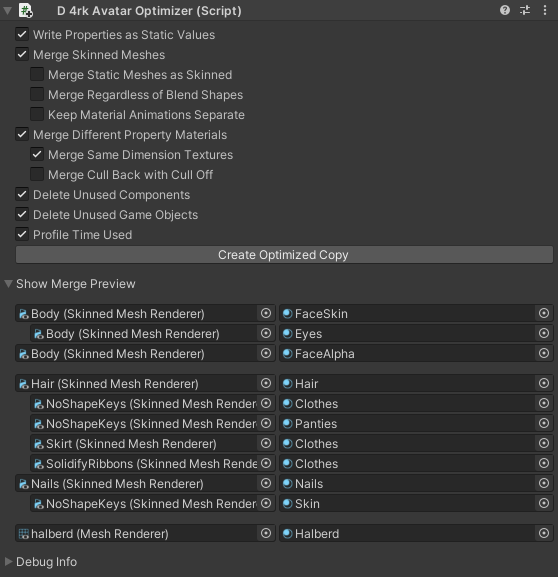

# d4rkAvatarOptimizer
d4rkpl4y3r's VRChat avatar 3.0 optimizer that aims to reduce skinned mesh & material count.
## How To Use
1. Add the d4rkAvatarOptimizer component to your avatar root. It should go on the same object that your VRC Avatar Descriptor is on.
2. Click the "Create Optimized Copy" button to create a new avatar with optimized materials and meshes.
3. Upload this optimized copy of your original avatar to vrc.
4. Delete the copy after you upload it to vrc.

There are also some settings to tweak the optimization. You can read about their effects in more detail here:

## Write Properties as Static Values
When enabled the optimizer will replace the uniform parameter definitions with a static value on all materials.  
For example `uniform float4 _Color;` will get changed to `static float4 _Color = float4(1, 0, 1, 1);`  
This enables the shader compiler to do more [constant folding](https://en.wikipedia.org/wiki/Constant_folding) and thus making the shader run faster.  
Unfortunately the shader compiler is allowed to ignore NaNs while doing that so if a shader is not made with that in mind this might cause some issues.
## Merge Skinned Meshes
The optimizer tries to merge different skinned meshes together.
If some of those skinned mesh game objects get toggled with animations in the fxlayer it will add logic to the shader to toggle those sub meshes in shader instead.
Skinned meshes that are on different layers (eg UIMenu) from each other will not get merged.  
Skinned meshes that are disabled and have no animation to turn them on will get deleted.  
Can't merge meshes that have any tessellation or surface shaders.  
## Merge Static Meshes as Skinned
Automatically converts static meshes to skinned meshes so that they can be merged with other meshes and have their materials merged as well.  
Does not convert meshes on the UIMenu layer since they are mostly used for computation.
## Merge Regardless of Blend Shapes
With this setting active the optimizer will merge meshes that have blend shapes with meshes that don't. Only use this if you have a small model since skinning with blend shapes is much more expensive than without.
## Keep Material Animations Separate
This makes sure that animated properties from one mesh don't animate the property on materials from a different mesh if their meshes got merged.
Can break since it creates a lot of constant buffer variables.
## Merge Different Property Materials
Merges materials with the same shader where properties can have different values.
If they do have different values the values will get written to a constant buffer.
Material IDs get written to uv.w and used to access the correct value from that cbuffer.

If your shader has a "lock in" or "bake" feature, make sure to not use it with this optimizer. Locked in shaders will have different actual shaders for each material, so they can't be combined. "Write Properties as Static Values" will take over the job of locking in the shaders.

Can't merge materials if:
* Shader is surface shader or has tessellation
* A property that differs is used in shader lab code (eg `ZWrite [_ZWrite]`)
* Materials have different Keywords set
## Merge Same Dimension Textures
Merges materials if they use different textures if their width, height & compression format match.
Creates a Texture2DArray from the original textures.

Can't merge materials if:
* Shader declares Texture2D or sampler2D properties with a custom macro.  
  eg `#define CUSTOM_TEX2D(name) Texture2D name`
## Merge Cull Back with Cull Off
Merges materials even if their culling properties differ. Forces culling to off.
## Merge Different Render Queue
Merges materials even if their render queue differs.
## Delete Unused Components
Deletes all components that are turned off and never get enabled by animations. It also deletes phys bone colliders that are not referenced by any used phys bone components.
## Delete Unused Game Objects
Deletes all game objects that have no used components and are not referenced in any other used components. This also applies to bones referenced in skinned meshes as long as the bones aren't moved by animations, eye look settings or phys bone components. It re parents the children of the deleted game objects to their respective parents as well as transfers its weight to the parent.
## Use Ring Finger as Foot Collider
Moves the ring finger collider to match the foot contact. This enables you to touch other players phys bones with your feet.
## Profile Time Used
Outputs how much time the different sections in the code took to execute.
## Create Optimized Copy
Creates a copy of the avatar and performs the selected optimizations on the copy.
Disables the original avatar so only the copy is active.  
None of the original assets will be changed so even if the optimizer fails your avatar is still safe!  
It also deletes the assets from the previous optimized copy. You should never change the optimized copy, it is only intended to be uploaded and then get deleted again.

In addition to the selected optimizations there are some optimizations that are always performed:
* Remove unused shape keys with zero weight. Unused here means not a viseme nor referenced in any animation in the fx layer.
* Bake unused shape keys with non-zero weight into the mesh data. (only if the blend shape has a single frame)
* Merge identical material slots on skinned meshes.
* Only reference bones if they have a non-zero weight on any vertex.
* Add dummy animation to animator states that have no animation specified.
* Remove illegal avatar components.
* Remove everything with the EditorOnly tag.
## Show Merge Preview
Shows a preview of how meshes and materials would get merged. Resulting meshes are separated by spaces. Materials that get merged together are indented. In the example image you can see that Body/Eyes would get merged with Body/FaceSkin.
## Show Debug Info
Shows debug information about how the optimizer is understanding the avatar.
### Unparsable Materials
Shows all materials that can't be parsed by the optimizer.
### Unmergable Materials
Shows all materials that can't be merged if their properties differ.
### Unmergable Texture Materials
Shows all materials that can't be merged if their textures differ.
### Unused Components
Shows all components that will get deleted by "Delete Unused Components".
### Always Disabled Game Objects
Lists all game objects that are disabled and never get enabled by animations.
### Material Swaps
Shows all materials that can be swapped into a material slot with an animation.
### Game Objects with Toggle Animation
Shows all game objects that have a toggle animation in the fx layer.
### Unmoving Bones
Shows all bones that are not moved by animations, eye look settings, phys bone components or constraints.