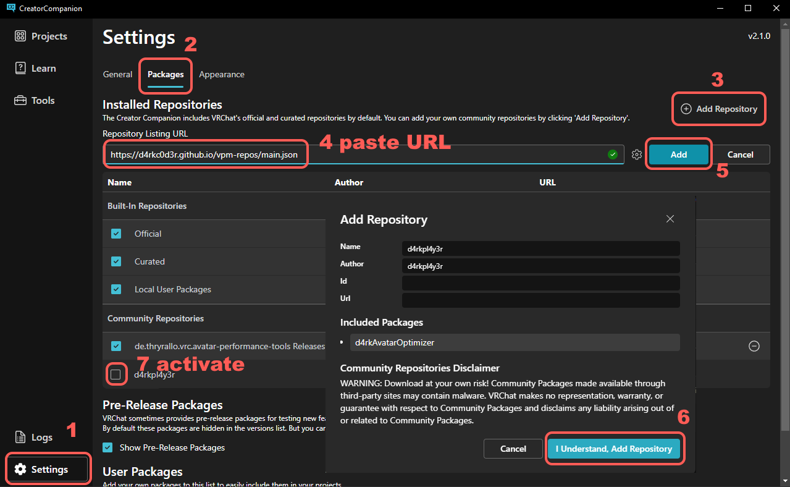

# d4rkAvatarOptimizer
d4rkpl4y3r's VRChat avatar 3.0 optimizer that aims to reduce skinned mesh & material count.

## How to Use
1. Add the d4rkAvatarOptimizer component to your avatar root. It should go on the same object that your VRC Avatar Descriptor is on.
2. Upload the avatar to vrc. The optimizations will be applied before upload automatically with the default settings.

Alternatively you can click the "Create Optimized Copy" button to create a new avatar with optimized materials and meshes. That way you can test the optimized version in editor to validate it works properly before uploading it. If everything works correctly you can then upload that optimized copy.

## Limitations
The optimizer relies on creating custom variations of your shaders that support shader toggles. As such, your avatar might not show up correctly if your shaders are disabled.  
For toggles that means all meshes that get merged will always be visible. If you use the option [Merge Same Dimension Textures](#merge-same-dimension-textures) and different textures in the `_MainTex` property get merged, those textures will show up as a white material like [here](https://github.com/d4rkc0d3r/d4rkAvatarOptimizer/issues/17) when shaders are blocked.  
Since it relies on custom shaders, the optimizer also won't work for quest avatars at all.

## Installation
To install the optimizer with VCC you need to add the url `https://d4rkc0d3r.github.io/vpm-repos/main.json` as a custom repository.

1. [Click here](https://d4rkc0d3r.github.io/vpm-repos/main_redirect.html)
2. Allow the redirect to open with VCC
3. VCC should now be open with a dialog asking you to add the repository
4. Click I understand, Add Repository in the popup after reading its contents

Alternatively you can do it manually:
1. Open VCC
2. Click Settings in the bottom left
3. Click the Packages tab at the top
4. Click Add Repository in the top right
5. Paste the url into the text field and click Add
6. Click I understand, Add Repository in the popup after reading its contents
7. Activate the checkbox next to the repository you just added

After that you can add and update the optimizer like any other packages in your VCC projects.

## Why my Shader Pink?

Shaders can do a lot of *weird* things, therefore the optimizer is bound to fail on some of them. You could try other shaders, for example:
* [ACLS](https://booth.pm/ja/items/1779615)
* [Silent Crosstone](https://gitlab.com/s-ilent/SCSS)

You can also tell the optimizer to ignore certain parts of the model with the "Exclusions" foldout.  
Finally you can try to make a bug report and maybe I'll be able to fix it.  
To do that you need to bundle up the optimized `.mat`, `.shader` & `.cginc` files. You can do that by right clicking on `d4rkAvatarOptimizer/TrashBin` in the project view under `Packages` and selecting `Show in Explorer`. A window with the folder selected should open. Go inside the folder and put the files into a `.zip` file. You don't need to include the `.asset` files as they can be very large and don't help when debugging the shaders.  
Once you have done that make a bug report on the [issue tracker](https://github.com/d4rkc0d3r/d4rkAvatarOptimizer/issues) where you can attach the `.zip` file.

## UI Options Documentation
There are also some settings to tweak the optimization. You can read about their effects in more detail here:

## Optimize on Upload
Automatically optimizes the avatar before uploading it to vrc. This is non destructive, the avatar in your scene will stay as it is.
## Write Properties as Static Values
This is very similar to what some shaders call locking in or baking. If you use this option you should disable the locking in or baking feature of your shader. If you don't use it you need to make sure to lock in or bake your shader before uploading it to vrc or running the optimizer.

When enabled the optimizer will replace the uniform parameter definitions with a static value on all materials.  
For example `uniform float4 _Color;` will get changed to `static float4 _Color = float4(1, 0, 1, 1);`  
This enables the shader compiler to do more [constant folding](https://en.wikipedia.org/wiki/Constant_folding) and thus making the shader run faster.  
Unfortunately the shader compiler is allowed to ignore NaNs while doing that so if a shader is not made with that in mind this might cause some issues.
## Merge Skinned Meshes
The optimizer tries to merge different skinned meshes together. If some of those skinned mesh game objects get toggled with animations in the fxlayer it will add logic to the shader to toggle those sub meshes in shader instead.
Skinned meshes that are on different layers (eg UIMenu) from each other will not get merged.  
Skinned meshes that are disabled and have no animation to turn them on will get deleted.  
Can't merge meshes that have any tessellation or surface shaders.  
## Merge Static Meshes as Skinned
Automatically converts static meshes to skinned meshes so that they can be merged with other meshes and have their materials merged as well. This only happens if the static mesh has materials that can be merged with materials from the skinned mesh it tries to get merged into.  
Does not convert meshes on the UIMenu layer since they are mostly used for computation.
## Merge Regardless of Blend Shapes
With this setting active the optimizer will merge meshes that have blend shapes with meshes that don't. Only use this if you have a small model since skinning with blend shapes is much more expensive than without.
## Keep Material Animations Separate
This makes sure that animated properties from one mesh don't animate the property on materials from a different mesh if their meshes got merged.
Can break since it creates a lot of constant buffer variables.
## Merge Different Property Materials
Merges materials with the same shader where properties can have different values. If they do have different values the values will get written to a constant buffer. Material IDs get written to uv.w and used to access the correct value from that cbuffer.

If your shader has a "lock in" or "bake" feature, make sure to not use it with this optimizer if you have "Write Properties as Static Values" enabled. Locked in shaders will have different actual shaders for each material, so they can't be combined. "Write Properties as Static Values" will take over the job of locking in the shaders.

Can't merge materials if:
* Shader is surface shader or has tessellation
* A property that differs is used in shader lab code (eg `ZWrite [_ZWrite]`)
* Materials have different Keywords set
* Material slot is affected by a material swap animation
## Merge Same Dimension Textures
Merges materials if they use different textures if their width, height & compression format match.
Creates a Texture2DArray from the original textures.

Can't merge materials if:
* Shader declares Texture2D or sampler2D properties with a custom macro.  
  eg `#define CUSTOM_TEX2D(name) Texture2D name`
* The textures use crunch compression.
## Merge Cull Back with Cull Off
Merges materials even if their culling properties differ. Forces culling to off.
## Merge Different Render Queue
Merges materials even if their render queue differs.
## Merge Same Ratio Blend Shapes
This option tries to merge blend shapes that always get animated in the same ratio.  
For example you have two animations. The first animates `A` to 100, `B` to 50 and `C` to 100. The second animates `A` to 50, `B` to 25 and `D` to 100. In this case the optimizer would merge `A` and `B` in a 2:1 ratio as they are always animated in that ratio.
## Merge Simple Toggles as BlendTree
Tries to find layers in the FXLayer that have exactly two states with one transition each that has a simple bool condition. The optimizer will then merge all layers like that into one by using a large direct blend tree.  
You can read about this technique [here](https://notes.sleightly.dev/dbt-combining/).
## Keep MMD Blend Shapes
When enabled the optimizer will keep the blend shapes that are used by MMD animations from getting removed or merged.
## Delete Unused Components
Deletes all components that are turned off and never get enabled by animations. It also deletes phys bone colliders that are not referenced by any used phys bone components.
## Delete Unused GameObjects
Deletes all game objects that have no used components and are not referenced in any other used components. This also applies to bones referenced in skinned meshes as long as the bones aren't moved by animations, eye look settings or phys bone components. It re parents the children of the deleted game objects to their respective parents as well as transfers its weight to the parent.
## Use Ring Finger as Foot Collider
Moves the ring finger collider to match the foot contact. This enables you to touch other players phys bones with your feet.
## Profile Time Used
Outputs how much time the different sections in the code took to execute.
## Exclusions
You can exclude certain parts of the model from all optimizations. Any Transform in this list will stop the optimizer from touching anything on that object or anything below it. The number in the parenthesis indicates how many transforms are excluded even if the foldout is closed.
## Create Optimized Copy
Creates a copy of the avatar and performs the selected optimizations on the copy.
Disables the original avatar so only the copy is active.  
None of the original assets will be changed so even if the optimizer fails your avatar is still safe!  
It also deletes the assets from the previous optimized copy. You should never change the optimized copy, it is only intended to be tested/uploaded and then get deleted again.

In addition to the selected optimizations there are some optimizations that are always performed:
* Remove unused shape keys with zero weight. Unused here means not a viseme nor referenced in any animation in the fx layer.
* Bake unused shape keys with non-zero weight into the mesh data. (only if the blend shape has a single frame)
* Merge identical material slots on skinned meshes.
* Only reference bones if they have a non-zero weight on any vertex.
* Add dummy animation to animator states that have no animation specified.
* Remove everything with the EditorOnly tag.
## Show Mesh & Material Merge Preview
Shows a preview of how meshes and materials would get merged.
Here you can see an example of this which will be referenced in this section:

In this detailed view the resulting meshes are separated by spaces. Materials that get merged together are indented. In the example you can see 3 resulting meshes. You can also see that `Body/FaceSkin` and `Body/Eyes` get merged into one material while `Body/FaceAlpha` is still its own material.
## Show FX Layer Merge Result
In this section you can see which layers in the FXLayer got recognized as a simple toggle layer and which ones didn't. The VRChat performance rank icons of Excellent are used for detected toggles while the Very Poor icon is used for layers that couldn't be merged.

The option Show Detailed Errors will show you the reasons why the optimizer rejected a layer as a simple toggle.
## Show Debug Info
Shows debug information about how the optimizer is understanding the avatar.
### Unparsable Materials
Shows all materials that can't be parsed by the optimizer.  
These materials stop the meshes they are int from getting merged with other meshes. It also disables the `Write Properties as Static Values` from getting applied to them.
### Unmergable Materials
Shows all materials that can't be merged if their properties differ.  
These materials could be parsed but use shader features that the optimizer can't handle. This stops the meshes they are in from getting merged with other meshes. Neither can they be merged with other materials that have different properties.
### Unmergable Texture Materials
Shows all materials that can't be merged if their textures differ.  
These materials use shader features that prevent the optimizer from merging textures into a Texture2DArray.
### Crunched Textures
Shows all textures that got crunch compressed. Crunch compressed textures can't be merged into Texture2DArrays and as such can prevent materials from being merged.
### NonBC5 Normal Maps
Shows all textures that are used as normal maps but don't use the BC5 compression format. BC5 normal maps have higher quality than DXT5 & BC7 normal maps while using the same amount of VRAM.
### Locked in Materials
Shows all materials that have a "lock in" or "bake" feature enabled which the optimizer detected. If you want to merge these materials you need to disable the "lock in" or "bake" feature.  
The optimizer might not detect all forms of "lock in" or "bake" so you might need to check some materials manually.
### Unlocked Materials
Shows all materials that have a "lock in" or "bake" feature disabled which the optimizer detected.  
With the `Write Properties as Static Values` option disabled you need to make sure to lock in or bake your materials in this list before optimization.
### Penetrators
Shows all meshes that the optimizer detected as DPS or TPS penetrators. If you have some that are not listed here you should add them to the exclusion list. If you don't your penetrators might get merged with other meshes which would always show them to other players if they have your shaders blocked.
### Unused Components
Shows all components that will get deleted by "Delete Unused Components".
### Always Disabled Game Objects
Shows all game objects that are disabled and never get enabled by animations.
### Material Swaps
Shows all materials that can be swapped into a material slot with an animation.
### Animated Material Property Paths
Shows all material properties with their game object path that are animated.
### Game Objects with Toggle Animation
Shows all game objects that have a toggle animation in the fx layer.
### Unmoving Bones
Shows all bones that are not moved by animations, eye look settings, phys bone components or constraints.